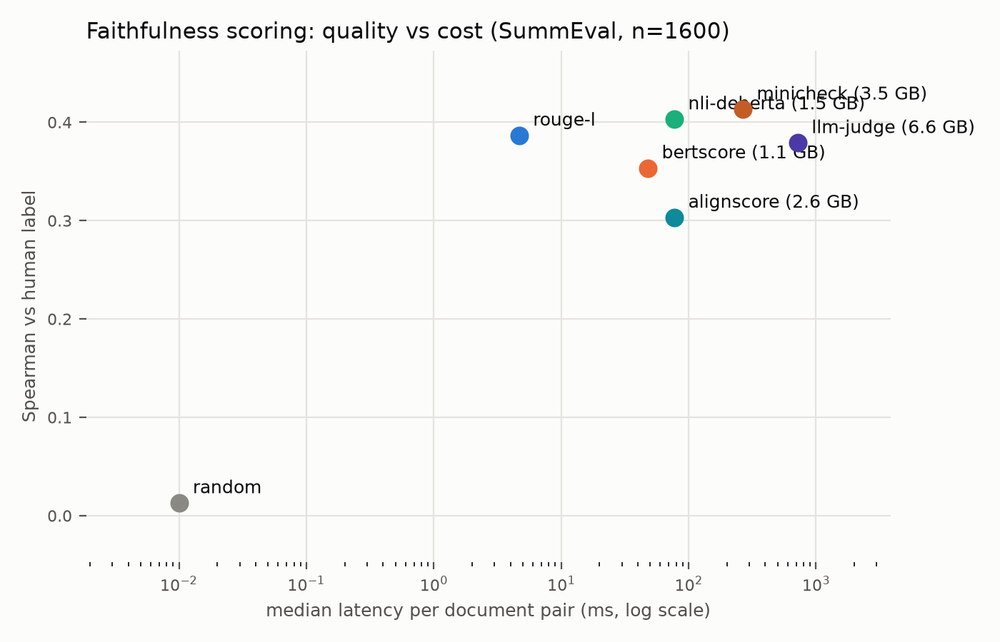
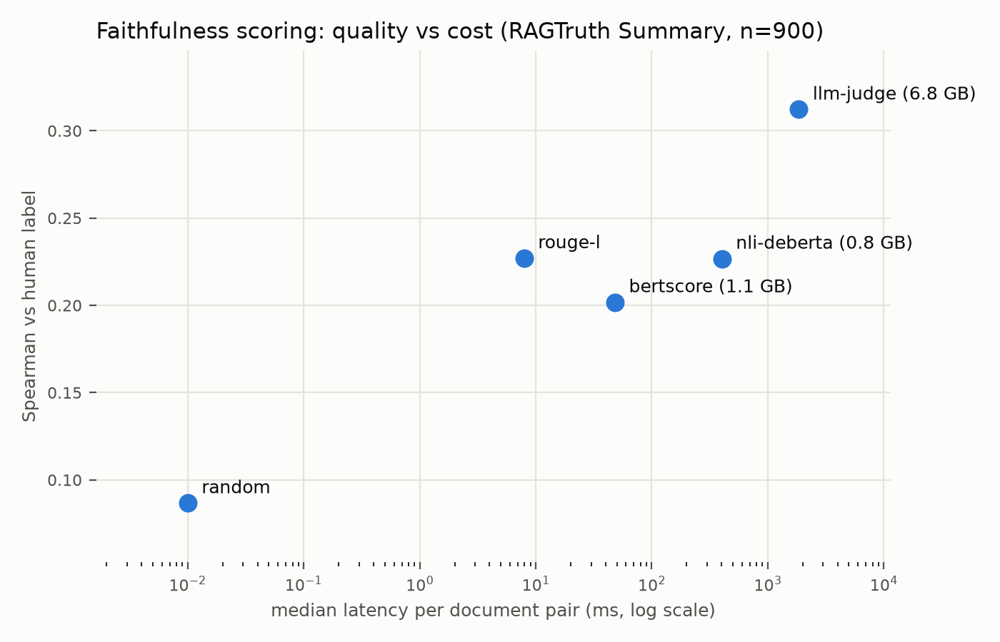

# faithful-eval

How well do summary-faithfulness scorers that run **entirely on local
hardware** detect unsupported claims — and what do they cost in latency and
VRAM?

Faithfulness benchmarks usually report correlation with human judgment and
stop there, assuming an API-based frontier judge. Nobody reports
quality-per-millisecond-per-gigabyte for scorers you can run inside a
customer's firewall. This repo measures that trade-off.

This is an independent, personal-time project built only on public datasets,
public models, and public tooling.

## Results

**Answer:** it depends which era of hallucination you measure.

- On **2019-era** SummEval errors, DeBERTa NLI is the best local quality/cost
  trade-off — it beats a 3B LLM judge on Spearman / bal_acc / ROC-AUC at ~4×
  less VRAM.
- On **LLM-era** RAGTruth summaries (GPT-4 / GPT-3.5 / Llama-2 / Mistral), the
  ranking **flips**: the 3B judge leads, and NLI falls to ROUGE-L levels on
  ROC-AUC. Cheap detectors that win on SummEval stop working when
  hallucinations get fluent.

Both runs on a local NVIDIA RTX 4000 Ada (~12 GB); judge =
`Qwen/Qwen2.5-3B-Instruct`. Latencies are only comparable within a run.

### SummEval (n=1600)

| scorer | spearman | balanced acc | ROC-AUC | median ms/doc | peak VRAM (GB) |
|---|---|---|---|---|---|
| random | 0.013 | 0.516 | 0.506 | 0.0 | 0.0 |
| rouge-l | 0.386 | 0.687 | 0.705 | 4.7 | 0.0 |
| bertscore | 0.353 | 0.710 | 0.750 | 48.0 | 1.1 |
| nli-deberta | 0.403 | 0.743 | 0.786 | 77.3 | 1.5 |
| llm-judge | 0.379 | 0.704 | 0.771 | 719.2 | 6.6 |



### RAGTruth Summary (n=900)

| scorer | spearman | balanced acc | ROC-AUC | median ms/doc | peak VRAM (GB) |
|---|---|---|---|---|---|
| random | 0.087 | 0.552 | 0.558 | 0.0 | 0.0 |
| rouge-l | 0.227 | 0.638 | 0.658 | 7.9 | 0.0 |
| bertscore | 0.202 | 0.632 | 0.640 | 48.2 | 1.1 |
| nli-deberta | 0.227 | 0.619 | 0.655 | 403.2 | 0.8 |
| llm-judge | 0.312 | 0.661 | 0.716 | 1853.6 | 6.8 |



## Benchmark

Two datasets, same scorer interface. Pick with `--dataset`:

| flag | what it is | label |
|---|---|---|
| `--dataset summeval` (default) | [SummEval](https://github.com/Yale-LILY/SummEval) — 100 CNN/DM articles × 16 **2019-era** system summaries, 3 expert consistency ratings | continuous 1–5; binary = consistency == 5.0 |
| `--dataset ragtruth` | [RAGTruth](https://arxiv.org/abs/2401.00396) (via `wandb/RAGTruth-processed`) — responses from GPT-4 / GPT-3.5 / Llama-2 / Mistral with human hallucination spans | soft label from span count; binary = zero spans |

RAGTruth defaults to the **Summary** task (900 test pairs) so the comparison
stays summary-faithfulness; pass `--task all` for QA + Data2txt too. SummEval
is fetched via the [BARTScore](https://github.com/neulab/BARTScore) vendored
pickle (Apache-2.0) and cached under `data/`.

**Metrics per scorer:**

- **spearman** — rank correlation of scorer output with the dataset's continuous label.
- **balanced acc / ROC-AUC** — binary faithfulness (see table above). Balanced accuracy uses an oracle threshold over the scorer's own outputs — same treatment for every scorer.
- **median ms/doc** — median wall-clock per `score(source, summary)` call.
- **peak VRAM** — `torch.cuda.max_memory_allocated`, reset before each scorer; `0.0` means CPU-only.

## Scorers

Everything implements one interface (`scorers.py`):

```python
class Scorer:
    name: str
    def score(self, source: str, summary: str) -> float: ...
```

| scorer | approach |
|---|---|
| `random` | uniform noise; floor for every metric |
| `rouge-l` | ROUGE-Lsum recall of the summary *against the source* — fraction of the summary supported lexically (note: not summary-vs-reference ROUGE, which measures relevance) |
| `bertscore` | BERTScore precision of summary vs source (roberta-large embeddings) |
| `nli-deberta` | SummaC-style zero-shot NLI (DeBERTa-v3 MNLI): min over summary sentences of max entailment over overlapping 2-sentence source chunks |
| `llm-judge` | Qwen2.5-Instruct (7B/3B/1.5B, auto-sized to detected VRAM) verifies each summary sentence against the article; score = mean P("yes") read from first-token logits |

## Reproducing

Needs Python 3.10+ and a CUDA GPU for the model scorers. Install a CUDA build
of PyTorch for your platform ([pytorch.org](https://pytorch.org)), then:

```bash
python -m venv .venv
# Windows: .venv\Scripts\activate
# Unix:    source .venv/bin/activate
pip install -r requirements.txt          # or: pip install -r requirements.lock.txt
python run.py            # full benchmark -> table on stdout + results.json
python plot.py           # results.json -> results.png + markdown table
```

`python run.py` downloads the dataset on first use and runs every scorer in
`SCORERS` (model weights fetched from Hugging Face on first use). The NLI
scorer needs ~2–4 GB of VRAM; the LLM judge picks the largest Qwen2.5 Instruct
model that fits your card (7B needs ~16 GB, 3B ~7 GB, 1.5B ~4 GB — pass
`model_name` to override). If NLTK raises an import-security error with a
project-local `.venv` on Python 3.14+, set
`NLTK_DISABLE_IMPORT_SECURITY=1` before running. Useful during development:

```bash
python run.py --only random,rouge-l      # subset of scorers
python run.py --limit 200                # seeded random subsample of pairs
python run.py --dataset ragtruth         # LLM-era RAGTruth Summary (900 pairs)
python run.py --dataset ragtruth --task all --limit 200
python smoke_test.py                     # model-free tests of scorer logic
```

The table is rewritten and `results.json` re-dumped after every scorer, so a
crash in scorer N never loses scorers 1..N-1.

Adding a scorer = implement the interface, append the class to `SCORERS` in
`run.py`. Nothing else changes.
