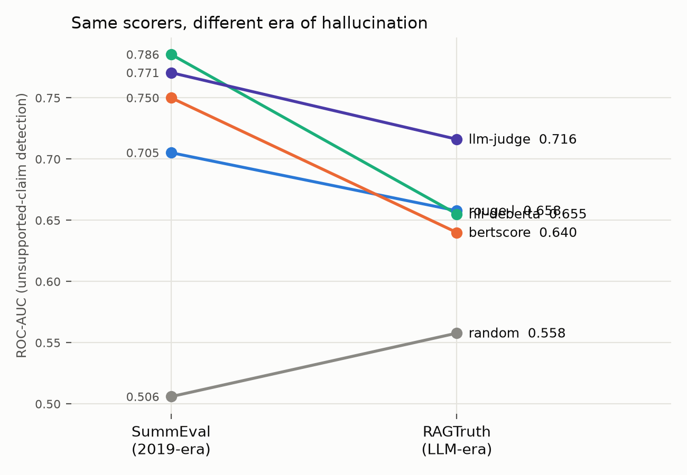
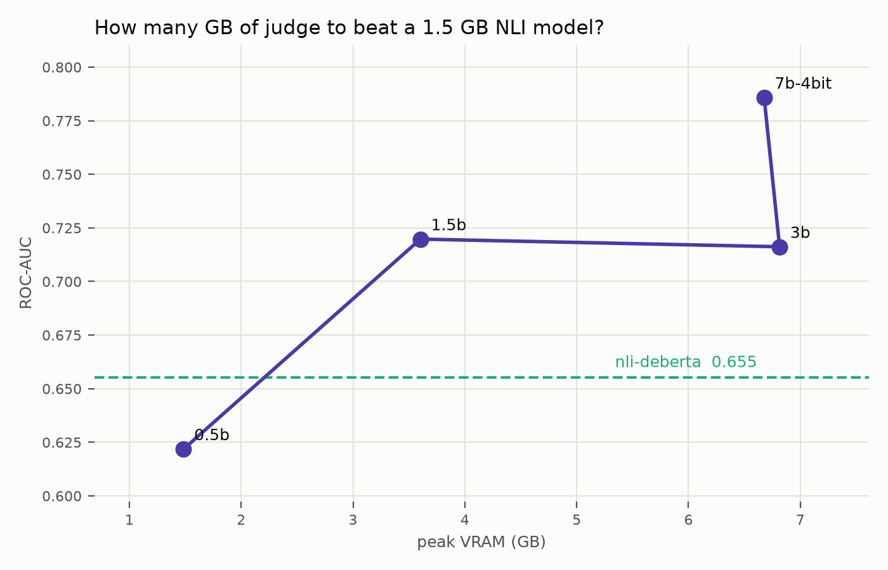

# faithful-eval

How well do summary-faithfulness scorers that run **entirely on local
hardware** detect unsupported claims — and what do they cost in latency and
VRAM?

Faithfulness benchmarks usually report correlation with human judgment and
stop there, assuming an API-based frontier judge. Nobody reports
quality-per-millisecond-per-gigabyte for scorers you can run inside a
customer's firewall. This repo measures that trade-off.

This is an independent, personal-time project built only on public datasets,
public models, and public tooling.

## Results

**Answer:** it depends on the era of the hallucination — and how big a judge
you can afford.

1. On **2019-era** SummEval, a ~1.5 GB NLI model beats a 3B LLM judge.
2. On **LLM-era** RAGTruth, NLI collapses to ROUGE-L levels. A 3B judge leads
   (directional — bootstrap CIs still overlap). A **7B-4bit** judge clears NLI
   with **non-overlapping** CIs (0.750–0.821 vs 0.613–0.697).
3. You do **not** need 3B to beat NLI on RAGTruth: **1.5B is the sweet spot**
   on this card (AUC 0.720 > 3B’s 0.716, half the VRAM).
4. NLI and the 3B judge fail on **different** examples (75% of errors are
   unique to one scorer) — cascades are justified, though a naive
   ROUGE→NLI→judge band cascade trades quality for speed.





Bootstrap AUC CIs from paired resampling of saved predictions
(`run.py --save-preds` → `analyze.py`). All numbers: RTX 4000 Ada (~12 GB).

### SummEval — 2019-era system summaries (n=1600)

| scorer | spearman | balanced acc | ROC-AUC | AUC 95% CI | median ms/doc | peak VRAM (GB) |
|---|---|---|---|---|---|---|
| random | 0.013 | 0.516 | 0.506 | 0.470–0.542 | 0.0 | 0.0 |
| rouge-l | 0.386 | 0.687 | 0.705 | 0.676–0.735 | 4.7 | 0.0 |
| bertscore | 0.353 | 0.710 | 0.750 | 0.723–0.777 | 48.0 | 1.1 |
| nli-deberta | 0.403 | 0.743 | 0.786 | 0.761–0.810 | 77.3 | 1.5 |
| llm-judge (3B) | 0.379 | 0.704 | 0.771 | 0.745–0.796 | 719.2 | 6.6 |


### RAGTruth — LLM-era summaries (n=900)

| scorer | spearman | balanced acc | ROC-AUC | AUC 95% CI | median ms/doc | peak VRAM (GB) |
|---|---|---|---|---|---|---|
| random | 0.087 | 0.552 | 0.558 | 0.514–0.601 | 0.0 | 0.0 |
| rouge-l | 0.227 | 0.638 | 0.658 | 0.615–0.699 | 7.4 | 0.0 |
| bertscore | 0.202 | 0.632 | 0.640 | 0.598–0.682 | 44.6 | 1.1 |
| nli-deberta | 0.227 | 0.619 | 0.655 | 0.613–0.697 | 108.9 | 0.8 |
| llm-judge (3B) | 0.312 | 0.661 | 0.716 | 0.680–0.751 | 535.3 | 6.8 |


### Judge scaling curve (RAGTruth, n=900)

| scorer | spearman | balanced acc | ROC-AUC | AUC 95% CI | median ms/doc | peak VRAM (GB) |
|---|---|---|---|---|---|---|
| llm-judge-0.5b | 0.177 | 0.592 | 0.622 | 0.578–0.666 | 215 | 1.5 |
| llm-judge-1.5b | 0.319 | 0.669 | **0.720** | 0.679–0.761 | 309 | 3.6 |
| llm-judge-3b | 0.312 | 0.661 | 0.716 | 0.680–0.751 | 541 | 6.8 |
| llm-judge-7b-4bit | **0.432** | **0.739** | **0.786** | **0.750–0.821** | 1174 | 6.7 |

0.5B loses to NLI. 1.5B is the first size whose point estimate clears NLI.
7B-4bit is the first whose CI sits entirely above NLI’s — and it fits in the
same ~7 GB envelope as the 3B via 4-bit quantization.

### Failure complementarity + cascade (RAGTruth)

At each scorer’s own oracle threshold, NLI vs 3B judge:

| | count |
|---|---:|
| both correct | 344 |
| both wrong | 138 |
| only NLI wrong (judge saves) | 267 |
| only judge wrong (NLI saves) | 151 |
| complementarity among errors | **75%** |

Naive cascade (keep ROUGE outside its middle tertile; else NLI; else judge):
AUC 0.639 at mean **92 ms/doc** — 89% of 3B-judge AUC at 17% of its latency,
but **does not beat NLI alone** on AUC. Cascades need better escalation
policy; the disagreement table says the headroom is real.

### What this means

Clumsy / older hallucinations → ship NLI. Fluent LLM hallucinations → you
need a local judge; **1.5B is enough to lead**, **7B-4bit is enough to win
decisively**, and both fit a 12 GB workstation card. BERTScore is dominated
on both datasets; ROUGE-L remains a strong CPU floor.

## Benchmark

Two datasets, same scorer interface. Pick with `--dataset`:

| flag | what it is | label |
|---|---|---|
| `--dataset summeval` (default) | [SummEval](https://github.com/Yale-LILY/SummEval) — 100 CNN/DM articles × 16 **2019-era** system summaries, 3 expert consistency ratings | continuous 1–5; binary = consistency == 5.0 |
| `--dataset ragtruth` | [RAGTruth](https://arxiv.org/abs/2401.00396) (via `wandb/RAGTruth-processed`) — responses from GPT-4 / GPT-3.5 / Llama-2 / Mistral with human hallucination spans | soft label from span count; binary = zero spans |

RAGTruth defaults to the **Summary** task (900 test pairs) so the comparison
stays summary-faithfulness; pass `--task all` for QA + Data2txt too. SummEval
is fetched via the [BARTScore](https://github.com/neulab/BARTScore) vendored
pickle (Apache-2.0) and cached under `data/`.

**Metrics per scorer:**

- **spearman** — rank correlation of scorer output with the dataset's continuous label.
- **balanced acc / ROC-AUC** — binary faithfulness (see table above). Balanced accuracy uses an oracle threshold over the scorer's own outputs — same treatment for every scorer.
- **median ms/doc** — median wall-clock per `score(source, summary)` call.
- **peak VRAM** — `torch.cuda.max_memory_allocated`, reset before each scorer; `0.0` means CPU-only.

## Scorers

Everything implements one interface (`scorers.py`):

```python
class Scorer:
    name: str
    def score(self, source: str, summary: str) -> float: ...
```

| scorer | approach |
|---|---|
| `random` | uniform noise; floor for every metric |
| `rouge-l` | ROUGE-Lsum recall of the summary *against the source* — fraction of the summary supported lexically (note: not summary-vs-reference ROUGE, which measures relevance) |
| `bertscore` | BERTScore precision of summary vs source (roberta-large embeddings) |
| `nli-deberta` | SummaC-style zero-shot NLI (DeBERTa-v3 MNLI): min over summary sentences of max entailment over overlapping 2-sentence source chunks |
| `llm-judge` | Qwen2.5-Instruct (7B/3B/1.5B, auto-sized to detected VRAM) verifies each summary sentence against the article; score = mean P("yes") read from first-token logits |

## Reproducing

Needs Python 3.10+ and a CUDA GPU for the model scorers. Install a CUDA build
of PyTorch for your platform ([pytorch.org](https://pytorch.org)), then:

```bash
python -m venv .venv
# Windows: .venv\Scripts\activate
# Unix:    source .venv/bin/activate
pip install -r requirements.txt          # or: pip install -r requirements.lock.txt
python run.py            # full benchmark -> table on stdout + results.json
python plot.py           # results.json -> results.png + markdown table
```

`python run.py` downloads the dataset on first use and runs every scorer in
`SCORERS` (model weights fetched from Hugging Face on first use). The NLI
scorer needs ~2–4 GB of VRAM; the LLM judge picks the largest Qwen2.5 Instruct
model that fits your card (7B needs ~16 GB, 3B ~7 GB, 1.5B ~4 GB — pass
`model_name` to override). If NLTK raises an import-security error with a
project-local `.venv` on Python 3.14+, set
`NLTK_DISABLE_IMPORT_SECURITY=1` before running. Useful during development:

```bash
python run.py --only random,rouge-l
python run.py --limit 200
python run.py --dataset ragtruth --save-preds   # writes *.preds.json
python analyze.py --preds results-ragtruth.preds.json
python run.py --dataset ragtruth --judge-model 0.5b,1.5b,3b,7b-4bit \
    --out results-scale.json --save-preds
python plot.py                 # also builds comparison.png + scale.png
python smoke_test.py
```

`--judge-model 7b-4bit` needs `bitsandbytes` + `accelerate`. The table and
JSON rewrite after every scorer, so a crash never loses finished rows.

Adding a scorer = implement the interface, append to `SCORERS` in `run.py`.
