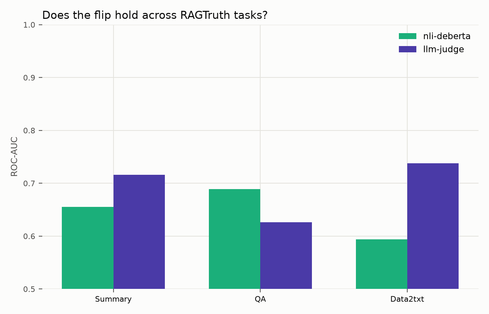
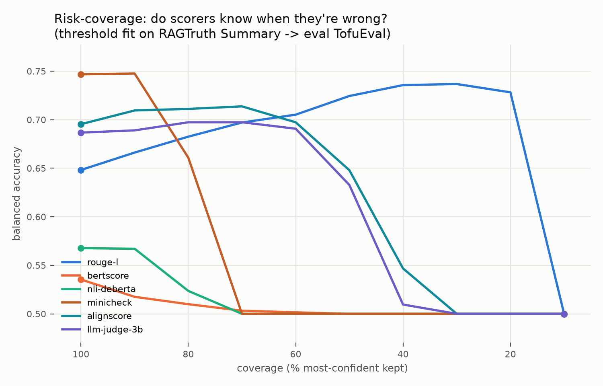
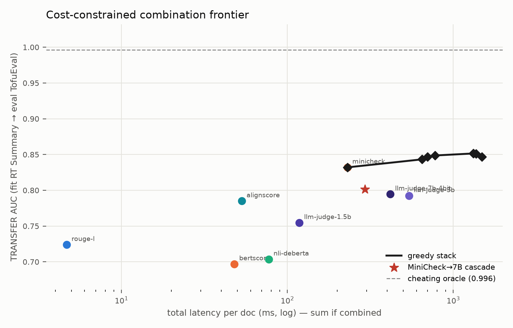

# faithful-eval

How well do summary-faithfulness scorers that run **entirely on local
hardware** detect unsupported claims — and what do they cost in latency and
VRAM?

Faithfulness benchmarks usually report correlation with human judgment and
stop there, assuming an API-based frontier judge. Nobody reports
quality-per-millisecond-per-gigabyte for scorers you can run inside a
customer's firewall. This repo measures that trade-off.

This is an independent, personal-time project built only on public datasets,
public models, and public tooling.

## Results

**Answer:** it depends on the *era* and the *task* — and that's the finding.

1. **Era (two LLM-era datasets).** On 2019-era SummEval, NLI beats a 3B judge.
   On LLM-era **RAGTruth Summary**, NLI collapses; **7B-4bit** clears it with
   non-overlapping CIs. On LLM-era **TofuEval** (dialogue summaries), a **3B**
   judge already clears NLI solidly (0.763–0.821 vs 0.675–0.732) — the flip
   replicates off RAGTruth.
2. **Task.** The flip is **not universal** across RAGTruth:
   - **Summary** — judge wins (3B directional, 7B-4bit solid vs NLI)
   - **Data2txt** — judge wins **solidly** (3B CI 0.706–0.771 vs NLI 0.556–0.633)
   - **QA** — ranking reverses again: **ROUGE-L wins** (0.729); even 7B-4bit
     (0.669) fails to beat cheap lexical/NLI baselines
3. **Cascade.** Complementarity is high (~70–75%), but NLI is a weak cheap gate
   on LLM-era text. Task-route QA→ROUGE; on Summary use **1.5B→7B** (95% of
   7B AUC @ 51% latency), not NLI→judge.




Bootstrap AUC CIs from paired resampling of saved predictions
(`run.py --save-preds` → `analyze.py`). All numbers: RTX 4000 Ada (~12 GB).

### SummEval — 2019-era system summaries (n=1600)

| scorer | spearman | balanced acc | ROC-AUC | AUC 95% CI | median ms/doc | peak VRAM (GB) |
|---|---|---|---|---|---|---|
| random | 0.013 | 0.516 | 0.506 | 0.470–0.542 | 0.0 | 0.0 |
| rouge-l | 0.386 | 0.687 | 0.705 | 0.676–0.735 | 4.7 | 0.0 |
| bertscore | 0.353 | 0.710 | 0.750 | 0.723–0.777 | 48.0 | 1.1 |
| nli-deberta | 0.403 | 0.743 | 0.786 | 0.761–0.810 | 77.3 | 1.5 |
| llm-judge (3B) | 0.379 | 0.704 | 0.771 | 0.745–0.796 | 719.2 | 6.6 |


### RAGTruth — LLM-era summaries (n=900)

| scorer | spearman | balanced acc | ROC-AUC | AUC 95% CI | median ms/doc | peak VRAM (GB) |
|---|---|---|---|---|---|---|
| random | 0.087 | 0.552 | 0.558 | 0.514–0.601 | 0.0 | 0.0 |
| rouge-l | 0.227 | 0.638 | 0.658 | 0.615–0.699 | 7.4 | 0.0 |
| bertscore | 0.202 | 0.632 | 0.640 | 0.598–0.682 | 44.6 | 1.1 |
| nli-deberta | 0.227 | 0.619 | 0.655 | 0.613–0.697 | 108.9 | 0.8 |
| llm-judge (3B) | 0.312 | 0.661 | 0.716 | 0.680–0.751 | 535.3 | 6.8 |


### Judge scaling curve (RAGTruth, n=900)

| scorer | spearman | balanced acc | ROC-AUC | AUC 95% CI | median ms/doc | peak VRAM (GB) |
|---|---|---|---|---|---|---|
| llm-judge-0.5b | 0.177 | 0.592 | 0.622 | 0.578–0.666 | 215 | 1.5 |
| llm-judge-1.5b | 0.319 | 0.669 | **0.720** | 0.679–0.761 | 309 | 3.6 |
| llm-judge-3b | 0.312 | 0.661 | 0.716 | 0.680–0.751 | 541 | 6.8 |
| llm-judge-7b-4bit | **0.432** | **0.739** | **0.786** | **0.750–0.821** | 1174 | 6.7 |

0.5B loses to NLI. 1.5B is the first size whose point estimate clears NLI.
7B-4bit is the first whose CI sits entirely above NLI’s — and it fits in the
same ~7 GB envelope as the 3B via 4-bit quantization.

### RAGTruth by task (n=900 each, 3B judge unless noted)

| task | rouge-l | nli-deberta | llm-judge 3B | llm-judge 7B-4bit | flip vs NLI |
|---|---:|---:|---:|---:|---|
| Summary | 0.658 | 0.655 | 0.716 | **0.786** | 3B directional / 7B **solid** |
| QA | **0.729** | 0.689 | 0.626 | 0.669 | judge **loses** (even at 7B) |
| Data2txt | 0.610 | 0.594 | **0.738** | — | 3B **solid** |

AUC 95% CIs (bootstrap): Summary NLI 0.613–0.697 vs 7B 0.750–0.821
(separated); Data2txt NLI 0.556–0.633 vs 3B 0.706–0.771 (separated); QA
ROUGE 0.691–0.765 vs 3B judge 0.582–0.668 (judge below).

### TofuEval — LLM-era dialogue summaries (n=1498)

Second modern dataset (MeetB + MediaS via gated `lytang/LLM-AggreFact`).
Needs `hf auth login` once.

| scorer | spearman | balanced acc | ROC-AUC | AUC 95% CI | median ms/doc | peak VRAM (GB) |
|---|---|---|---|---|---|---|
| random | -0.014 | 0.504 | 0.490 | 0.454–0.525 | 0.0 | 0.0 |
| rouge-l | 0.319 | 0.679 | 0.724 | 0.692–0.760 | 5.8 | 0.0 |
| bertscore | 0.280 | 0.674 | 0.697 | 0.666–0.730 | 46.3 | 1.1 |
| nli-deberta | 0.290 | 0.672 | 0.704 | 0.675–0.732 | 56.5 | 0.9 |
| llm-judge (3B) | **0.416** | **0.717** | **0.792** | **0.763–0.821** | 207 | 6.8 |

Flip gate NLI vs 3B: **solid** (CIs do not overlap). NLI fails to beat ROUGE
here too — same “cheap detectors stall on fluent LLM text” pattern as RAGTruth
Summary, and this time 3B is enough without a 7B.

### Failure complementarity + cascade (Summary)

At each scorer’s own oracle threshold, NLI vs 3B judge on Summary:

| | count |
|---|---:|
| both correct | 344 |
| both wrong | 138 |
| only NLI wrong (judge saves) | 267 |
| only judge wrong (NLI saves) | 151 |
| complementarity among errors | **75%** |

QA / Data2txt complementarity: 69% / 73%. Naive Summary cascade (ROUGE→NLI→judge
tertile bands): AUC 0.639 at 92 ms/doc — fast, but does not beat NLI alone.

### Learned router (`router.py`)

Path 2: logistic regression on **cheap features only** (lengths, ROUGE, NLI,
task) picks among {ROUGE, NLI, 3B judge}. Train on one corpus, test on another.
Scores are z-calibrated on train so mixing doesn’t destroy AUC. Soft-gated =
mixture that only *calls* the judge when p(judge) ≥ ⅓.

| train → test | rouge | nli | judge | task-heur | hard | soft-gated | judge% (hard/soft) |
|---|---:|---:|---:|---:|---:|---:|---:|
| RAGTruth → TofuEval | 0.724 | 0.704 | **0.792** | 0.792 | 0.691 | 0.744 | 5% / 29% |
| TofuEval → Summary | 0.658 | 0.655 | **0.716** | 0.716 | 0.607 | 0.661 | 0% / 0% |
| Summary+D2T → QA | 0.729 | 0.689 | 0.626 | 0.729 | 0.734 | **0.763** | 41% / 52% |
| QA+D2T → Summary | 0.658 | 0.655 | **0.716** | 0.716 | 0.663 | 0.689 | 3% / 4% |
| Summary+QA → D2T | 0.610 | 0.594 | **0.738** | 0.738 | 0.724 | 0.731 | 90% / 93% |

**Verdict:** the learned router does **not** replace the hand-written recipe
cross-dataset (TofuEval still wants always-judge). It *does* beat always-ROUGE
on leave-one-task QA (0.763 vs 0.729) by calling the judge ~40% of the time.
Oracle routing hits ~0.9 AUC — headroom exists; LR on these features isn’t
enough to claim “method dominates the tools.” Deployable baseline remains
**task heuristic + optional 1.5B→7B cascade**.

### Detectability vs generator strength (`by_generator.py`)

Zero-GPU follow-up: slice RAGTruth preds by generating model
(llama-2-7b → … → GPT-4). Hypothesis: **detector AUC falls as generators
get stronger.**

**Verdict: not a clean arms-race curve.** Caveat first — GPT-3.5/4 Summary
and QA slices have ≤6 unfaithful labels each, so those AUCs are unstable.
On class-balanced open-model slices:

| task | NLI vs gen strength | 3B judge | 7B-4bit |
|---|---|---|---|
| Summary | flat | **rises** | flat |
| QA | mild fall | falls | mild fall |
| Data2txt | falls (incl. GPT) | mild fall | — |

So the era flip (2019 → LLM) does **not** simply continue as a monotonic
within-era decay for every detector. Stronger generators do get cleaner
faithful-rates; cheap detectors don’t systematically die across the open
Llama/Mistral ladder the way the headline hoped. The ambitious claim needs
a different design (more hard negatives per generator, or Path 2’s router).

### Task-aware cascade (`cascade.py`)

Complementarity says a cascade should help; the naive one didn't. Next question:
route by **task**, escalate by **confidence**, report one cascade row per task.

| task | policy | ROC-AUC | mean ms | vs target |
|---|---|---|---:|---|
| QA | ROUGE-L only | **0.729** | 4 | = best (judge loses here) |
| Summary | NLI → mid-band 7B-4bit | 0.645 | 471 | 82% of 7B AUC @ 40% latency |
| Data2txt | NLI → mid-band 3B | 0.574 | 950 | 78% of 3B AUC @ 79% latency |

**Task routing works; NLI-gated escalation does not.** On Summary/Data2txt the
NLI confidence band is the wrong cheap gate (skewed near zero on LLM-era text) —
you keep ~⅔ of docs on NLI and the cascade underperforms the full judge.

The cascade that *does* approach 7B quality is judge→judge on Summary:

| policy | ROC-AUC | mean ms | vs 7B-4bit |
|---|---|---:|---|
| **1.5B → mid-band 7B-4bit** | **0.748** | **597** | **95% AUC @ 51% latency** |
| NLI → 7B @ wide q[0.1,0.9] | 0.747 | 961 | 95% AUC but 82% latency (barely a cascade) |

Ceiling is high; the cheap gate has to be a smaller judge, not NLI.

### Specialized cheap detectors (MiniCheck, AlignScore)

Trained grounding metrics as drop-in scorers (`minicheck`, `alignscore`), same
interface and hardware. New result files only — existing tables unchanged.

| scorer | dataset | ROC-AUC | AUC 95% CI | median ms/doc | peak VRAM (GB) |
|---|---|---|---|---|---|
| minicheck | SummEval | 0.791 | 0.756–0.825 | 267 | 3.5 |
| alignscore | SummEval | 0.714 | 0.680–0.746 | 77 | 2.6 |
| minicheck | RAGTruth Summary | **0.795** | 0.759–0.831 | 499 | 3.8 |
| alignscore | RAGTruth Summary | 0.731 | 0.692–0.767 | 145 | 7.4 |
| minicheck | TofuEval | **0.832** | 0.806–0.858 | 231 | 3.6 |
| alignscore | TofuEval | 0.785 | 0.756–0.814 | 53 | 1.5 |

Generic NLI on the same splits: SummEval 0.786, RAGTruth Summary **0.655**,
TofuEval **0.704**. MiniCheck matches NLI on SummEval and **clears it on both
LLM-era sets** (non-overlapping CIs vs NLI on RAGTruth and TofuEval). AlignScore
also beats NLI on the LLM-era sets, though MiniCheck leads. Specialized cheap
detectors do not collapse the way zero-shot DeBERTa NLI does on fluent LLM text.

### NLI chunk-size sensitivity (QA)

RAGTruth QA only (n=900). Overlapping source chunks of 1 / 2 (default) / 3
sentences. Optional `NLIScorer(chunk_size=…)` — default unchanged.

| chunk_size | scorer | ROC-AUC | AUC 95% CI | median ms/doc |
|---:|---|---|---|---|
| 1 | nli-deberta-chunk1 | 0.604 | 0.554–0.652 | 52 |
| 2 | nli-deberta (default) | 0.689 | 0.643–0.732 | 62 |
| 3 | nli-deberta-chunk3 | **0.733** | 0.689–0.778 | 71 |

NLI’s QA result is **not** fully robust to chunking: size-1 is clearly worse;
size-3 reaches ROUGE-L territory (0.729) on this split. The default size-2
ranking vs the judge still holds, but the absolute NLI number moves with the
chunk choice.

### Judge prompt-variance

1.5B judge on RAGTruth Summary (n=900), three meaning-preserving prompt
paraphrases (original = p1). 7B-4bit skipped (~45–60 min × 3).

| prompt | ROC-AUC | AUC 95% CI | median ms/doc |
|---|---|---|---|
| p1 (original) | 0.720 | 0.679–0.761 | 566 |
| p2 | 0.726 | 0.686–0.770 | 607 |
| p3 | 0.698 | 0.656–0.740 | 613 |

Min–max spread on 1.5B: **0.029 AUC**. Point estimates stay above NLI (0.655);
CIs still overlap NLI and each other.

### What this means

- Clumsy / older hallucinations → ship **NLI**.
- Fluent LLM **summaries** (RAGTruth + TofuEval) and **data-to-text** → a
  local judge pays off; on TofuEval **3B is already solid**, on RAGTruth
  Summary **1.5B leads / 7B-4bit decides**. Want most of 7B quality cheaper
  → **1.5B→7B cascade**, not NLI→judge. **MiniCheck** is a strong cheap
  alternative that holds on LLM-era summaries where generic NLI fails.
- Fluent LLM **QA** → don't bother with a judge; **ROUGE-L** is best here.
- One scorer never wins everywhere — measure the task, then pick.

## Do scorers know when they're wrong?

Accuracy ranks scorers by whether they are right. Deployment often needs a
different property: whether a scorer’s **own confidence** flags its errors
(selective prediction, cascades, human review). Analysis in `calibration.py`.

**Correction.** An earlier version of this section used `c = |score − t|`. When
`t` is off-centre (e.g. MiniCheck `t ≈ 0.23`), that measure ranks one side of
the threshold above the other, so top-coverage slices become single-class and
balanced accuracy collapses to 0.5 by construction — not a real finding.
Degenerate coverage points are now reported as `null` and dropped from AURC.
Judges are no longer mixed into cross-dataset tables via a within-RAGTruth
split; 1.5B and 7B-4bit were run on TofuEval so every scorer faces the same
protocol.

**Corrected confidence (two definitions, reported side by side):**
**(a)** isotonic `score → P(faithful)` on the fit split, then `c = |p − 0.5|`;
**(b)** two-sided rank: percentile of `s` within the same side of `t`.

**Two regimes (never mixed in one ranking):**
- **IN** — 5-fold CV within a dataset (fit on 4 folds, eval held-out).
- **SHIFT** — fit on one corpus, evaluate on the other; omit scorers missing
  either side.

### Risk–coverage — Regime SHIFT (fit RT Summary → eval TofuEval)

| scorer | AUC | acc@50% (a) | AURC (a) ↓ | acc@50% (b) | AURC (b) ↓ |
|---|---:|---:|---:|---:|---:|
| minicheck | **0.832** | 0.679 | 0.243 | **0.867** | **0.130** |
| llm-judge-7b-4bit | 0.795 | **0.806** | **0.146** | 0.838 | 0.167 |
| llm-judge-3b | 0.792 | 0.731 | 0.251 | 0.768 | 0.204 |
| alignscore | 0.785 | 0.811 | 0.238 | 0.771 | 0.210 |
| llm-judge-1.5b | 0.755 | 0.775 | 0.231 | 0.803 | 0.194 |
| rouge-l | 0.724 | 0.590 | 0.336 | 0.734 | 0.235 |
| nli-deberta | 0.704 | null | null | 0.682 | 0.290 |
| bertscore | 0.697 | 0.543 | 0.401 | 0.548 | 0.408 |

Under **(b) two-sided rank**, MiniCheck leads both AUC and AURC on this
transfer; the AURC order still differs from AUC in the mid ranks
(`rankings_match: false`). Under **(a) calibrated**, 7B leads AURC and the
ranking diverges more (NLI’s AURC is `null` — too many degenerate coverage
points). So: with a threshold-symmetric confidence, accuracy and
self-knowledge **mostly track** (MiniCheck is no longer “accurate but blind”);
the two confidence definitions still disagree with each other. Full IN tables
and the reverse SHIFT direction: `results-calibration-regimes.json`.
Figure (gaps = null points, not interpolated): [`calibration.png`](calibration.png).



### Threshold transferability

How badly does a decision threshold port? `t_A` fit on A, applied to B, vs
B’s own `t_B`. Penalty = bal-acc(t_B) − bal-acc(t_A).

| scorer | RT→TF penalty | TF→RT penalty |
|---|---:|---:|
| llm-judge-7b-4bit | **0.006** | 0.022 |
| minicheck | 0.012 | 0.024 |
| llm-judge-1.5b | 0.013 | 0.027 |
| rouge-l | 0.031 | 0.062 |
| llm-judge-3b | 0.031 | **0.146** |
| alignscore | 0.034 | 0.126 |
| nli-deberta | 0.104 | 0.064 |
| bertscore | **0.139** | 0.121 |

**Not** the expected “trained metrics all shift / ROUGE ports.” MiniCheck and
the 1.5B/7B judges transfer thresholds well; BERTScore, AlignScore (TF→RT),
and the 3B judge (TF→RT, `t` jumps 0.06 ↔ 0.55) do not. Details:
`results-threshold-transfer.json`.

### Cascade gate sweep (RAGTruth Summary → 7B-4bit)

Unaffected by the confidence bug (uses mid-band escalation, not `|s−t|`).
Same soft-cascade protocol as `cascade.py`; only the cheap gate changes.

| gate | cascade AUC | mean ms/doc | escalated % | % of 7B AUC | % of 7B latency |
|---|---:|---:|---:|---:|---:|
| rouge-l | 0.664 | 403 | 34% | 84% | 34% |
| nli-deberta | 0.645 | 471 | 34% | 82% | 40% |
| **minicheck** | **0.784** | 728 | 34% | **100%** | **62%** |
| alignscore | 0.746 | 495 | 34% | 95% | 42% |
| llm-judge-1.5b | 0.748 | 597 | 33% | 95% | 51% |

MiniCheck-gated retains ~100% of 7B AUC at 62% latency vs NLI-gated 82% at
40% (ΔAUC ≈ +0.139). Confirmed unchanged after the calibration fix.
`results-cascade-gates.json`.

### Calibration error (ECE / Brier)

Isotonic `score → P(faithful)` under the same IN / SHIFT regimes
(`results-ece-corrected.json`; prior `results-ece.json` kept). IN ECE is low
for everyone (~0.01–0.03). SHIFT ECE is where scores break: AlignScore and
especially llm-judge-3b on RT→TF (ECE 0.164 / 0.258) while MiniCheck and
ROUGE-L stay nearer 0.06. Probability miscalibration under shift is real;
the earlier “MiniCheck ordering-uninformative” label was an artifact of
degenerate `|s−t|` confidence.

## Can routing beat the best single scorer?

Phase 0 (`ensemble.py`): before investing in a better router, measure how much
of the ~0.9 oracle ceiling is **learnable** vs noise, and try the missing
baseline — **stacking** (learned combination of scores, not hard selection).

**Coverage note.** SummEval has only MiniCheck/AlignScore `*.preds.json` (base
scorers were never saved per-example). Leave-one-out stacking therefore uses
RAGTruth Summary / QA / TofuEval. spaCy NER was skipped for speed
(`FAITHFUL_EVAL_SPACY=1` to enable). Details: `results-coverage.json`.

### Gate — is “which scorer is correct” predictable?

GBM on cheap features (lengths, ROUGE, overlaps, …), 5-fold CV. Decisive
test: on examples where two scorers **disagree**, predict which is right.

| dataset | pair | n disagree | which-correct AUC | call |
|---|---|---:|---:|---|
| RAGTruth Summary | **minicheck vs 7B-4bit** | 258 | **0.546** | **NOISE → no-go** |
| TofuEval | **minicheck vs 7B-4bit** | 350 | **0.560** | **NOISE → no-go** |
| RAGTruth Summary | nli vs 3B | 400 | 0.633 | weak |
| TofuEval | nli vs 3B | 625 | 0.691 | weak |
| RAGTruth Summary | rouge-l vs 3B | 379 | 0.762 | strong* |
| TofuEval | rouge-l vs 3B | 457 | 0.793 | strong* |

\*ROUGE-vs-judge disagreements are predictable from lexical features — that is
closer to the already-known task split (QA→ROUGE) than to general routing
among strong detectors. The **primary** cascade pair (MiniCheck vs 7B) is
noise. `results-predictability.json`.

### Oracle decomposition (headline)

On MiniCheck vs 7B-4bit:

| dataset | best single | cheating oracle | random pick | learnable (GBM pick) | learnable % of headroom |
|---|---:|---:|---:|---:|---:|
| RAGTruth Summary | 0.795 (MiniCheck) | 0.938 | 0.645 | 0.769 | **−18%** |
| TofuEval | 0.832 (MiniCheck) | 0.963 | 0.728 | 0.803 | **−22%** |

The disagreement model **hurts** vs always picking the best single. Essentially
**none** of the oracle headroom over MiniCheck is learnable with these
features — the complementarity is irreducible noise. **Go/no-go: no-go** for
a hard-routing research program. `results-oracle-decomposition.json`.

### Stacking (the missing baseline)

Combine the *vector* of scorer outputs (LR / calibrated LR / GBM).

**IN (5-fold CV):**

| dataset | best single | MiniCheck→7B cascade | stack LR | stack GBM | stack LR (isotonic inputs) |
|---|---:|---:|---:|---:|---:|
| RAGTruth Summary | 0.795 | 0.784 | 0.820 | 0.812 | **0.827** |
| TofuEval | 0.832 | 0.801 | **0.848** | 0.830 | 0.845 |

**TRANSFER (fit one corpus → eval the other; rich scorer set):**

| direction | best single | cascade | stack LR | stack GBM | failed router (prior) |
|---|---:|---:|---:|---:|---:|
| RT Summary → TofuEval | 0.832 | 0.801 | **0.847** | 0.836 | 0.744 |
| TofuEval → RT Summary | 0.795 | 0.784 | **0.826** | 0.778 | — |

Leave-one-out among Summary/QA/TofuEval (narrower shared scorers, no
MiniCheck on QA): stack LR 0.729 / 0.747 / 0.801 vs best singles 0.716 /
0.729 / 0.792 — small or null gains. **Combining beats hard routing**; on
rich Summary↔TofuEval transfer, a linear stack slightly beats MiniCheck alone
and clearly beats the failed router. `results-stacking.json`.

### Cost-constrained frontier

Greedy forward selection maximizing TRANSFER AUC (train on RT Summary, eval
TofuEval). Latency = **sum** of member medians (sequential); peak VRAM =
**max** of members.

| budget | what wins |
|---|---|
| Low (~230 ms, ~3.6 GB) | **MiniCheck alone** (0.832) |
| Medium (~650 ms, ~6.6 GB) | MiniCheck + 7B stack (0.843); cascade is in the same band at mixed latency |
| High (~1.3 s+) | Diminishing returns (peak greedy ≈ 0.852); cheating oracle ~0.96 stays out of reach |



**Conclusion.** Routing among strong detectors is a **no-go** — the oracle gap
is mostly noise. Stacking is a real but modest gain over the best single
scorer; the practical deployment answer remains MiniCheck alone or the
MiniCheck→7B cascade, not a learned router. `results-frontier.json`.

## Benchmark

Three datasets, same scorer interface. Pick with `--dataset`:

| flag | what it is | label |
|---|---|---|
| `--dataset summeval` (default) | [SummEval](https://github.com/Yale-LILY/SummEval) — 100 CNN/DM articles × 16 **2019-era** system summaries, 3 expert consistency ratings | continuous 1–5; binary = consistency == 5.0 |
| `--dataset ragtruth` | [RAGTruth](https://arxiv.org/abs/2401.00396) (via `wandb/RAGTruth-processed`) — responses from GPT-4 / GPT-3.5 / Llama-2 / Mistral with human hallucination spans | soft label from span count; binary = zero spans |
| `--dataset tofueval` | [TofuEval](https://arxiv.org/abs/2402.13249) via gated [`lytang/LLM-AggreFact`](https://huggingface.co/datasets/lytang/LLM-AggreFact) — MeetB + MediaS dialogue summary claims | binary human label (1 = faithful) |

RAGTruth defaults to the **Summary** task (900 test pairs) so the comparison
stays summary-faithfulness; pass `--task all` for QA + Data2txt too. SummEval
is fetched via the [BARTScore](https://github.com/neulab/BARTScore) vendored
pickle (Apache-2.0) and cached under `data/`.

**Metrics per scorer:**

- **spearman** — rank correlation of scorer output with the dataset's continuous label.
- **balanced acc / ROC-AUC** — binary faithfulness (see table above). Balanced accuracy uses an oracle threshold over the scorer's own outputs — same treatment for every scorer.
- **median ms/doc** — median wall-clock per `score(source, summary)` call.
- **peak VRAM** — `torch.cuda.max_memory_allocated`, reset before each scorer; `0.0` means CPU-only.

## Scorers

Everything implements one interface (`scorers.py`):

```python
class Scorer:
    name: str
    def score(self, source: str, summary: str) -> float: ...
```

| scorer | approach |
|---|---|
| `random` | uniform noise; floor for every metric |
| `rouge-l` | ROUGE-Lsum recall of the summary *against the source* — fraction of the summary supported lexically (note: not summary-vs-reference ROUGE, which measures relevance) |
| `bertscore` | BERTScore precision of summary vs source (roberta-large embeddings) |
| `nli-deberta` | SummaC-style zero-shot NLI (DeBERTa-v3 MNLI): min over summary sentences of max entailment over overlapping 2-sentence source chunks |
| `llm-judge` | Qwen2.5-Instruct (7B/3B/1.5B, auto-sized to detected VRAM) verifies each summary sentence against the article; score = mean P("yes") read from first-token logits |

## Reproducing

Needs Python 3.10+ and a CUDA GPU for the model scorers. Install a CUDA build
of PyTorch for your platform ([pytorch.org](https://pytorch.org)), then:

```bash
python -m venv .venv
# Windows: .venv\Scripts\activate
# Unix:    source .venv/bin/activate
pip install -r requirements.txt          # or: pip install -r requirements.lock.txt
python run.py            # full benchmark -> table on stdout + results.json
python plot.py           # results.json -> results.png + markdown table
```

`python run.py` downloads the dataset on first use and runs every scorer in
`SCORERS` (model weights fetched from Hugging Face on first use). The NLI
scorer needs ~2–4 GB of VRAM; the LLM judge picks the largest Qwen2.5 Instruct
model that fits your card (7B needs ~16 GB, 3B ~7 GB, 1.5B ~4 GB — pass
`model_name` to override). If NLTK raises an import-security error with a
project-local `.venv` on Python 3.14+, set
`NLTK_DISABLE_IMPORT_SECURITY=1` before running. Useful during development:

```bash
python run.py --only random,rouge-l
python run.py --limit 200
python run.py --dataset ragtruth --save-preds   # writes *.preds.json
python analyze.py --preds results-ragtruth.preds.json
python run.py --dataset ragtruth --judge-model 0.5b,1.5b,3b,7b-4bit \
    --out results-scale.json --save-preds
python cascade.py              # task-aware cascade from saved preds
python router.py               # learned router (cross-dataset / leave-one-task)
python run.py --dataset tofueval --out results-tofueval.json --save-preds
python plot.py                 # also builds comparison.png + scale.png
python smoke_test.py
```

TofuEval / LLM-AggreFact is gated: request access on the Hub, then
`hf auth login` before the first `--dataset tofueval` run.

`--judge-model 7b-4bit` needs `bitsandbytes` + `accelerate`. The table and
JSON rewrite after every scorer, so a crash never loses finished rows.

Adding a scorer = implement the interface, append to `SCORERS` in `run.py`.
